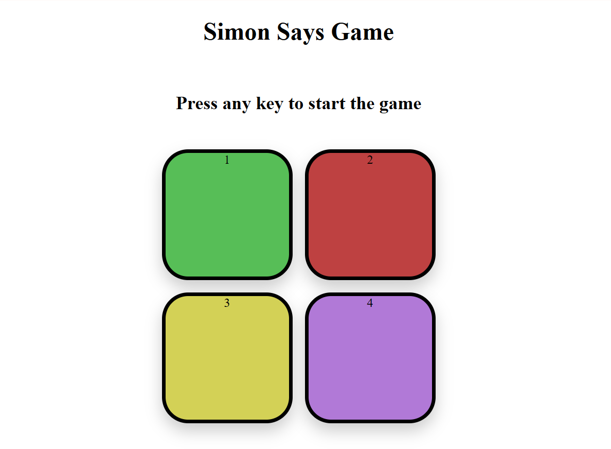

## 🎮 Simon Says Game


A simple and interactive **Simon Says memory game** built using **HTML, CSS, and JavaScript**.
The goal of the game is to remember and repeat the sequence of colors generated by the game.
With every correct round, the level increases and the sequence becomes longer, making the game more challenging.
The game tests your memory by generating a color sequence that the player must repeat correctly to progress through levels.

---

## 📌 Project Overview
Simon Says is a classic memory game where:

* The game flashes a sequence of colored buttons
* The player must repeat the same sequence in the correct order
* Each new level adds one more color to the sequence
* The game ends when the player makes a wrong move

This project focuses on **DOM manipulation**, **event handling**, and **basic game logic** in JavaScript.

---

## 🛠️ Technologies Used

* **HTML5** – Structure of the game
* **CSS3** – Styling and button animations
* **JavaScript (ES6)** – Game logic and interactivity

---
## 🔗 Let's Try To Play

[Click Me](https://soyamkayasth.github.io/Simon-Says-Game/)

---

## 🎯 Features

* Start the game by pressing any key
* Random color sequence generation
* Button flash animation for visual feedback
* Sound effects for button press and wrong input
* Level tracking system
* High score display
* Automatic game reset on wrong input

---

## 🎮 How to Play

1. Press any key to start the game
2. Watch the color sequence carefully
3. Click the buttons in the same order
4. Each correct round increases the level
5. A wrong click ends the game
6. Press any key to restart

---

## 📂 Project Structure

```
Simon-Says-Game/
│
├── index.html
├── style.css
├── app.js
├── sounds/
│   ├── red.mp3
│   ├── green.mp3
│   ├── yellow.mp3
│   ├── purple.mp3
│   └── wrong.mp3
└── README.md
```

---

## 🧠 JavaScript Concepts Used

* Event handling (`click`, `keypress`)
* Arrays for sequence management
* Random number generation
* DOM manipulation
* Conditional logic
* Timers using `setTimeout()`

---

## 📸 Game Preview

```

```

---

## 🚀 Future Enhancements

* Mobile-friendly touch support
* Improved animations and UI
* Difficulty levels
* High score storage using Local Storage
* Restart button

---

## 👨‍💻 Author

**Soyam Kayasth**
Student | Web Development

---

## 📜 License

This project is open source and intended for learning and practice.

---
